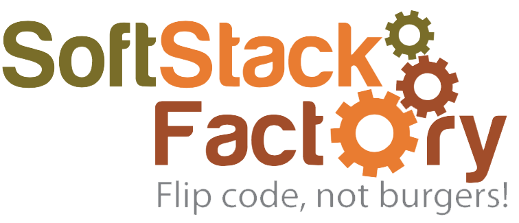

# SoftStack Factory Data Science Primer

This 7-part mini-course will provide a gentle introduction to data science and applied machine learning. If you're a developer, analyst, manager, or aspiring data scientist looking learn more about data science, then you're in the right place.

## Day 1: Bird's Eye View

This data science primer will cover exploratory analysis, data cleaning, feature engineering, algorithm selection, and model training. As you can see, those chunks make up 80% of the pie. They also set the foundation for more advanced techniques.

In this first chapter, you’ll see how these moving pieces fit together.

## Day 2: Exploratory Analysis

There’s a lot of trial and error, so how do you avoid chasing dead ends? The answer is “Exploratory Analysis.” (Which is just fancy-talk for “getting to know” your data.)

Doing this upfront helps you save time and avoid wild goose chases… As a data scientist, you are a commander with limited resources (i.e. time). Exploratory analysis is like sending scouts to learn where to deploy your forces!

## Day 3: Data Cleaning

Proper data cleaning is the “secret” sauce behind machine learning… Well, it’s not really a “secret”… It’s just a bit boring, so no one really talks about it. But the truth is:

Better data beats fancier algorithms…

(Even if you forget everything else from this primer, please remember this point)

Garbage in = Garbage out... Plain and Simple! If you have a clean dataset, even simple algorithms can learn impressive insights from it!

Now, as you might imagine, different problems will require different methods… For now though, let’s at least ensure we know how to fix the most common issues. This chapter will give you a reliable starting point, regardless of your dataset.

## Day 4: Feature Engineering

To start, feature engineering is very open-ended. There are literally infinite options for new features to create. Plus, you’ll need domain knowledge to add informative features instead of more noise.

This is a skill that you’ll develop with time and practice, but heuristics will give you a head start. Heuristics help you know where to start looking, spark ideas, and get unstuck.

## Day 5: Algorithm Selection

Our goal is to explain a few essential concepts (e.g. regularization, ensembling, automatic feature selection) that will teach you why some algorithms tend to perform better than others.

In applied machine learning, individual algorithms should be swapped in and out depending on which performs best for the problem and the dataset.

Therefore, we will focus on intuition and practical benefits over math and theory.

We have two main goals:

- To explain powerful mechanisms in modern ML.
- To introduce several algorithms that use those mechanisms.

## Day 6: Model Training

It might seem like it took a while to get here, but data scientists actually do spend most their time on the earlier steps:

1. Exploring the data.
2. Cleaning the data.
3. Engineering new features.
   Again, that’s because better data beats fancier algorithms.

Now you'll learn how to maximize model performance while safeguarding against overfitting. Plus, you'll learn how to automatically find the best parameters for each algorithm.

We'll get an overview of splitting your dataset, deciding on hyperparameters, setting up cross-validation, fitting and tuning models, and finally… selecting a winner!

## Day 7/8: Final Project

Final project where students are given a dataset similar to the real estate data we worked with throughout the course. Students are expected to go through each of the steps covered and build a model on their own. For extra credit they are asked to convert the sale price into a category (low, medium, high) then build a categorical classifier.

 
 
 

##### Sponsered by SoftBrew Inc.
